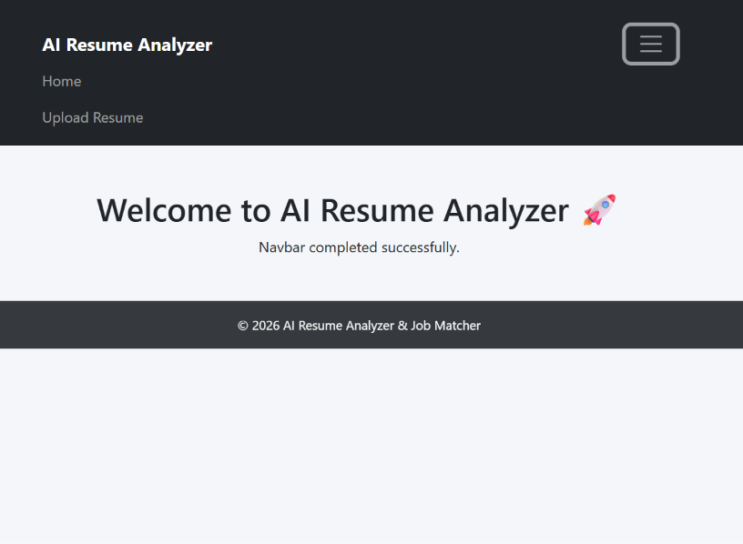
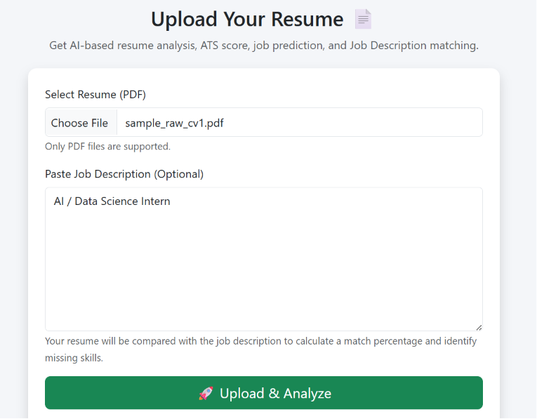
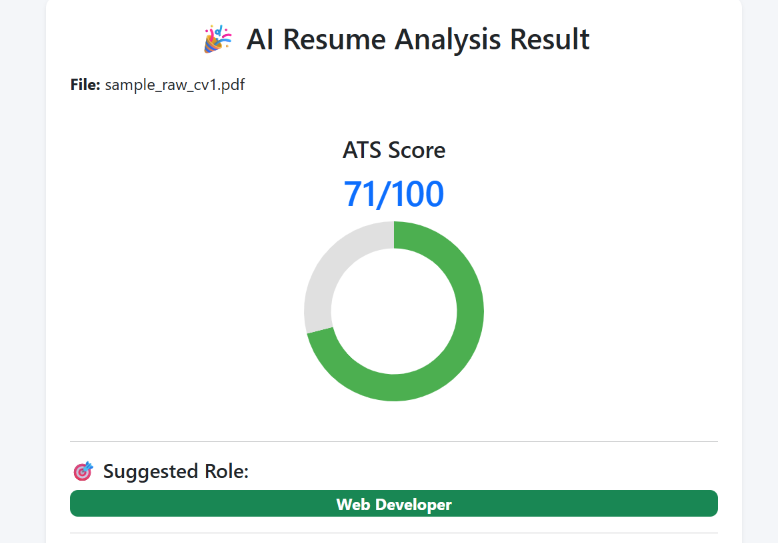
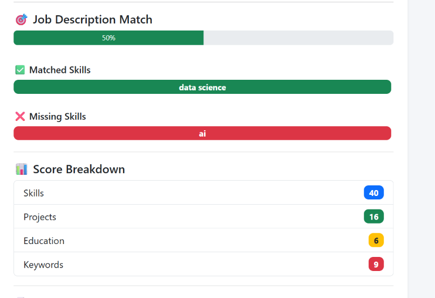

# 🤖 AI Resume Analyzer

An AI-powered Resume Analyzer built using **Python** and **Flask** that analyzes resumes, calculates an ATS (Applicant Tracking System) score, extracts technical skills, recommends suitable job roles, and compares resumes with a Job Description (JD).
## 🌐 Live Demo

**Live Application:** https://ai-resume-analyzer-pays.onrender.com

---

## 📌 Features

- 📄 Upload Resume (PDF)
- 📑 Extract Resume Text
- 💻 Technical Skill Extraction
- 📊 ATS Score Calculation (0–100)
- 🎯 Suggested Job Role Detection
- 🤝 Job Description Matching
- ✅ Matched Skills Detection
- ❌ Missing Skills Detection
- 📄 Resume Preview
- 🌐 Responsive Web Interface

---

## 🛠 Technologies Used

### Backend
- Python
- Flask
- PyPDF2
- Jinja2

### Frontend
- HTML5
- CSS3
- JavaScript

### Tools
- Git
- GitHub
- VS Code

---

## 📂 Project Structure

```
AI-Resume-Analyzer/
│
├── app.py
├── requirements.txt
├── README.md
├── .gitignore
│
├── static/
│   ├── css/
│   ├── js/
│   └── images/
│       └── screenshots/
│           ├── home.png
│           ├── upload.png
│           ├── result.png
│           └── job-match.png
│
├── templates/
│   ├── base.html
│   ├── index.html
│   ├── upload.html
│   └── result.html
│
└── uploads/
```

---

## 🚀 Installation

### 1. Clone the Repository

```bash
git clone https://github.com/GandeRani/AI-Resume-Analyzer.git
```

### 2. Navigate to the Project Folder

```bash
cd AI-Resume-Analyzer
```

### 3. Create a Virtual Environment

**Windows**

```bash
python -m venv venv
venv\Scripts\activate
```

**Linux / macOS**

```bash
python3 -m venv venv
source venv/bin/activate
```

### 4. Install Dependencies

```bash
pip install -r requirements.txt
```

---

## ▶️ Run the Application

```bash
python app.py
```

Open your browser and visit:

```
http://127.0.0.1:5000
```

---

## 📖 How It Works

1. Upload a PDF resume.
2. Resume text is extracted using **PyPDF2**.
3. Technical skills are identified.
4. ATS score is calculated.
5. A suitable job role is recommended.
6. (Optional) Paste a Job Description.
7. Resume skills are compared with the Job Description.
8. Matching skills, missing skills, and match percentage are displayed.

---

## 📊 ATS Score Breakdown

| Category | Marks |
|----------|------:|
| Skills | 40 |
| Projects | 20 |
| Education | 10 |
| Experience | 10 |
| Certifications | 10 |
| Resume Length | 10 |
| **Total** | **100** |

---

## 🎯 Supported Domains

The analyzer detects resumes related to:

- 🌐 Web Development
- 🤖 AI / Machine Learning
- 📊 Data Science
- ⚙️ VLSI / Digital Design
- 🔌 Embedded Systems
- ☁️ Cloud / DevOps
- 💼 General Software Engineering

---

## 💡 Supported Skills

The system detects skills including:

- Python
- Java
- C
- C++
- C#
- HTML
- CSS
- JavaScript
- TypeScript
- React
- Node.js
- Express.js
- SQL
- MySQL
- PostgreSQL
- MongoDB
- Docker
- Kubernetes
- AWS
- Azure
- Git
- GitHub
- Linux
- TensorFlow
- PyTorch
- NumPy
- Pandas
- Machine Learning
- Deep Learning
- AI
- Verilog
- SystemVerilog
- FPGA
- ASIC
- VLSI
- Embedded Systems
- Arduino
- Raspberry Pi
- Flutter
- Kotlin
- Firebase
- REST API
- GraphQL
- And many more...

---

## 📷 Screenshots

### 🏠 Home Page



---

### 📤 Resume Upload



---

### 📈 Resume Analysis



---

### 🎯 Job Description Matching



---

## 🔮 Future Improvements

- AI-powered Resume Suggestions
- Resume Ranking
- OCR Support for Scanned PDFs
- Export Report as PDF
- Charts & Analytics Dashboard
- Resume Comparison
- NLP-based Resume Parsing
- AI Chatbot for Resume Improvement

---

## 👩‍💻 Author

**Gande Rani**

📧 GitHub Profile: https://github.com/GandeRani

📂 Project Repository: https://github.com/GandeRani/AI-Resume-Analyzer

---

